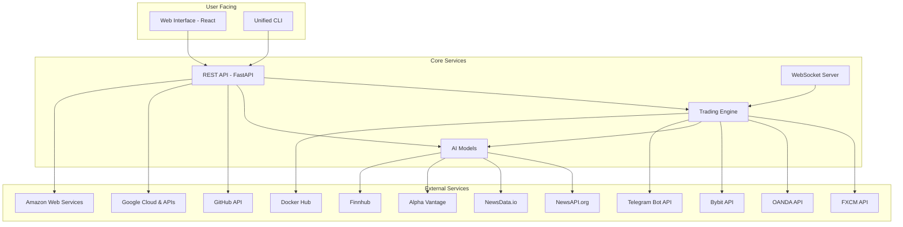

# GenX Trading Platform - Network Map

This document outlines the network architecture of the GenX Trading Platform, detailing the connections between its various components and external services.

## Network Architecture Diagram

## Connection Details

### Internal Services

| Service From     | Service To       | Protocol(s) | Purpose                                       | Authentication |
| ---------------- | ---------------- | ----------- | --------------------------------------------- | -------------- |
| Web Interface    | REST API         | HTTP/HTTPS  | User interactions, data visualization         | JWT            |
| Unified CLI      | REST API         | HTTP/HTTPS  | System management, trading operations         | API Key        |
| REST API         | Trading Engine   | Internal    | Triggering trades, fetching market data       | Internal       |
| REST API         | AI Models        | Internal    | Getting predictions and sentiment analysis    | Internal       |
| WebSocket Server | Trading Engine   | WebSocket   | Real-time market data streaming               | Internal       |

### External Dependencies

| Service From | Service To              | Protocol(s) | Purpose                                       | Authentication |
| ------------ | ----------------------- | ----------- | --------------------------------------------- | -------------- |
| Trading Engine | FXCM API              | HTTP/HTTPS  | Forex trading, market data                    | API Key        |
| Trading Engine | OANDA API             | HTTP/HTTPS, WebSocket | Forex trading, market data                    | API Key        |
| Trading Engine | Bybit API             | HTTP/HTTPS, WebSocket | Cryptocurrency trading, market data           | API Key        |
| AI Models      | NewsAPI.org           | HTTP/HTTPS  | News aggregation for sentiment analysis       | API Key        |
| AI Models      | NewsData.io           | HTTP/HTTPS  | News aggregation for sentiment analysis       | API Key        |
| AI Models      | Alpha Vantage         | HTTP/HTTPS  | Market data and news for sentiment analysis   | API Key        |
| AI Models      | Finnhub               | HTTP/HTTPS  | Market data and news for sentiment analysis   | API Key        |
| Trading Engine | Telegram Bot API      | HTTP/HTTPS  | Sending notifications and alerts              | Bot Token      |
| REST API     | GitHub API            | HTTP/HTTPS  | Repository management, CI/CD                  | OAuth Token    |
| API/Deployment | Google Cloud & APIs   | HTTP/HTTPS  | Cloud deployment, Google Sheets/Drive         | Service Account|
| API/Deployment | Amazon Web Services   | HTTP/HTTPS  | Cloud deployment (S3, EC2, etc.)              | AWS Credentials|
| Trading Engine | Docker Hub            | HTTP/HTTPS  | Pulling Docker images for deployment          | Docker Login   |

### User-Facing Services

| Service          | Protocol(s) | Purpose                                       |
| ---------------- | ----------- | --------------------------------------------- |
| Web Interface    | HTTP/HTTPS  | Provides a graphical user interface for users |
| WebSocket API    | WebSocket   | Real-time data streaming to the client        |
| REST API         | HTTP/HTTPS  | Exposes endpoints for CLI and UI interactions |
