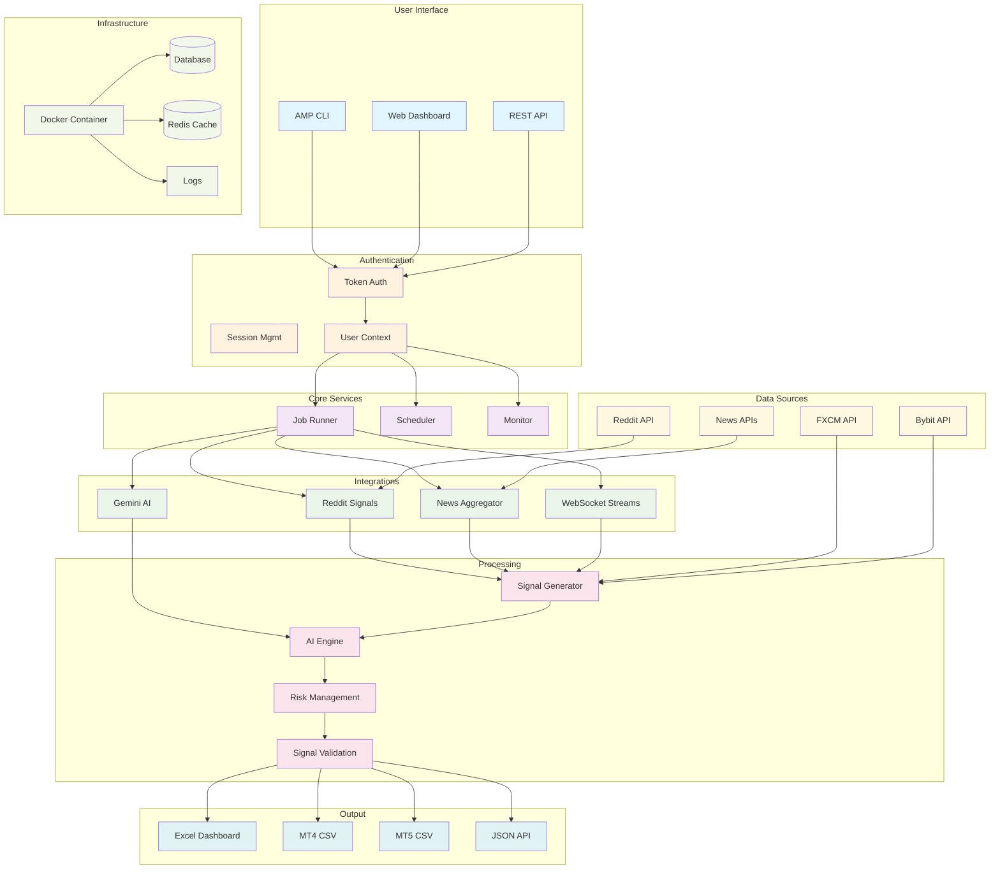
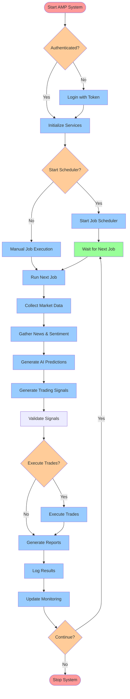
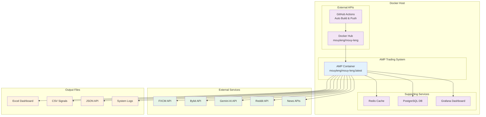

# 🚀 GenX FX Trading System

**Advanced AI-Powered Forex Signal Generator for MT4/5 Expert Advisors**

[](https://opensource.org/licenses/MIT)
[](https://hub.docker.com/r/mouyleng/mouy-leng)
[](https://github.com/Mouy-leng/GenX_FX/actions)
[](https://www.python.org/)
[](https://github.com/Mouy-leng/GenX_FX)

GenX FX is a sophisticated trading system that uses ensemble machine learning models to generate high-quality forex trading signals. Designed specifically to feed signals to MetaTrader 4/5 Expert Advisors through Excel/CSV files.

## 🏗️ System Architecture



## 🔄 Workflow Diagram



## 🐳 Docker Deployment Architecture



## 📊 **Project Status**

[](https://github.com/Mouy-leng/GenX_FX/actions)
[](https://github.com/Mouy-leng/GenX_FX)
[](https://hub.docker.com/r/mouyleng/mouy-leng)
[](https://github.com/Mouy-leng/GenX_FX/stargazers)
[](https://github.com/Mouy-leng/GenX_FX/network)
[](https://github.com/Mouy-leng/GenX_FX/issues)
[](https://github.com/Mouy-leng/GenX_FX/pulls)

## ✨ Key Features

### 🤖 **Advanced AI Engine**
- **Ensemble Learning**: Combines 5+ ML models (Random Forest, XGBoost, LightGBM, SVM, Neural Networks)
- **Multi-Timeframe Analysis**: M15, H1, H4, D1 confluence validation
- **Dynamic Feature Engineering**: 50+ technical indicators and market microstructure features
- **Real-time Model Training**: Automatic retraining every 24 hours
- **Confidence Scoring**: Advanced signal validation and strength assessment

### 📊 **Signal Output for MT4/5**
- **Excel Dashboard**: Professional formatted Excel with color coding and charts
- **MT4 CSV**: Simplified format optimized for MT4 EAs
- **MT5 CSV**: Enhanced format with additional metadata for MT5 EAs
- **JSON API**: Real-time signal data for custom integrations
- **Automatic Updates**: Real-time signal refresh every 30 seconds

### 🛡️ **Risk Management**
- **Position Sizing**: Dynamic position sizing based on volatility and risk parameters
- **ATR-Based Stops**: Adaptive stop-loss and take-profit levels
- **Risk/Reward Validation**: Minimum 1.5:1 risk-reward ratio
- **Market Condition Awareness**: Volatility and trend-based adjustments
- **Multi-Symbol Risk Control**: Maximum exposure limits across all pairs

### 💹 **Market Coverage**
- **7 Major Pairs**: EURUSD, GBPUSD, USDJPY, USDCHF, AUDUSD, USDCAD, NZDUSD
- **Multiple Timeframes**: M15, H1, H4, D1 analysis
- **Session Awareness**: London, New York, Asian session optimization
- **Economic Calendar Integration**: (Optional) Fundamental analysis overlay

## 🚀 Quick Start

### 🐳 **Deploy with Docker (Recommended)**

[](https://hub.docker.com/r/mouyleng/mouy-leng)
[](https://github.com/Mouy-leng/GenX_FX/blob/main/docker-compose.amp.yml)

```bash
# Quick deployment with Docker Compose
git clone https://github.com/Mouy-leng/GenX_FX.git
cd GenX_FX
docker-compose -f docker-compose.amp.yml up -d
```

### 📦 **Manual Installation**

```bash
# Clone the repository
git clone https://github.com/Mouy-leng/GenX_FX.git
cd GenX_FX

# Install dependencies
pip install -r requirements.txt
pip install -r requirements-amp.txt

# Create necessary directories
mkdir -p config logs signal_output ai_models
```

### 2. Configuration

Edit `config/trading_config.json`:

```json
{
  "fxcm": {
    "use_mock": true,  // Set to false for real FXCM data
    "access_token": "your_fxcm_token"
  },
  "risk_management": {
    "max_risk_per_trade": 0.02,  // 2% risk per trade
    "max_total_risk": 0.06       // 6% total portfolio risk
  }
}
```

### 3. Run the System

```bash
# Generate sample signals for testing
python main.py sample --count 5

# Train AI models with historical data
python main.py train --symbols EURUSD GBPUSD

# Run live signal generation
python main.py live

# Run backtesting
python main.py backtest --start-date 2023-01-01 --end-date 2024-01-01
```

## 📈 Signal Output Files

The system generates several files in the `signal_output/` directory:

### 📊 **Excel Dashboard** (`genx_signals.xlsx`)
- **Active Signals**: Current trading opportunities
- **Signal History**: Historical signal performance
- **Performance Metrics**: Win rates, confidence averages
- **Summary Dashboard**: System status and statistics

### 📋 **MT4 Signals** (`MT4_Signals.csv`)
```csv
Magic,Symbol,Signal,EntryPrice,StopLoss,TakeProfit,LotSize,Timestamp
123456,EURUSD,BUY,1.10500,1.10300,1.10900,0.02,2024-01-15 14:30:00
```

### 📋 **MT5 Signals** (`MT5_Signals.csv`)
```csv
Magic,Symbol,Signal,EntryPrice,StopLoss,TakeProfit,Volume,Confidence,RiskReward,Expiry,Comment
123456,EURUSD,BUY,1.10500,1.10300,1.10900,0.02,0.78,2.0,2024-01-15 18:30:00,GenX_UPTREND_STRONG
```

## 🔧 MT4/5 EA Integration

### Sample MT4 EA Code

```mql4
// Read signals from CSV file
string filename = "MT4_Signals.csv";
int file = FileOpen(filename, FILE_READ|FILE_CSV);

if(file != INVALID_HANDLE) {
    while(!FileIsEnding(file)) {
        string magic = FileReadString(file);
        string symbol = FileReadString(file);
        string signal = FileReadString(file);
        double entry = FileReadNumber(file);
        double sl = FileReadNumber(file);
        double tp = FileReadNumber(file);
        double lots = FileReadNumber(file);
        
        // Execute trade based on signal
        if(symbol == Symbol() && signal == "BUY") {
            OrderSend(Symbol(), OP_BUY, lots, Ask, 3, sl, tp, "GenX Signal", magic);
        }
    }
    FileClose(file);
}
```

## 🎯 System Modes

### **Live Trading** 
```bash
python main.py live
```
- Continuous signal generation
- Real-time market data processing
- Automatic file updates every 30 seconds
- Performance monitoring and logging

### **Training Mode**
```bash
python main.py train --symbols EURUSD GBPUSD --timeframes H1 H4
```
- Download historical data
- Train ensemble ML models
- Cross-validation and performance metrics
- Model serialization and storage

### **Backtesting**
```bash
python main.py backtest --start-date 2023-01-01 --end-date 2024-01-01
```
- Historical strategy testing
- Performance metrics calculation
- Sharpe ratio, max drawdown, win rate analysis
- Trade-by-trade results

### **Testing**
```bash
python main.py test
```
- System component validation
- Data provider connectivity tests
- AI model prediction tests
- Signal generation verification

## 📊 Performance Metrics

The system tracks comprehensive performance metrics:

- **Signal Accuracy**: Prediction success rate
- **Risk-Adjusted Returns**: Sharpe ratio, Calmar ratio
- **Drawdown Analysis**: Maximum and average drawdowns
- **Win Rate**: Percentage of profitable signals
- **Risk/Reward**: Average risk-reward ratios
- **Model Performance**: Individual model contributions

## 🔧 Advanced Configuration

### **AI Model Tuning**
```json
{
  "ai_models": {
    "ensemble_size": 5,
    "retrain_interval_hours": 24,
    "confidence_threshold_dynamic": true,
    "models": {
      "random_forest": {"enabled": true, "n_estimators": 100},
      "xgboost": {"enabled": true, "learning_rate": 0.1},
      "lightgbm": {"enabled": true, "max_depth": 6}
    }
  }
}
```

### **Risk Management**
```json
{
  "risk_management": {
    "max_risk_per_trade": 0.02,
    "position_sizing_method": "fixed_fractional",
    "stop_loss_method": "atr_based",
    "volatility_adjustment": true
  }
}
```

### **Signal Validation**
```json
{
  "validation": {
    "timeframe_confluence_required": 2,
    "technical_confluence_threshold": 3,
    "multi_timeframe_validation": true
  }
}
```

## 🔌 FXCM Integration

For real market data, configure FXCM credentials:

```json
{
  "fxcm": {
    "use_mock": false,
    "environment": "demo",  // or "real"
    "access_token": "your_fxcm_access_token",
    "server_url": "https://api-fxpractice.fxcm.com"
  }
}
```

1. **Get FXCM Token**: Register at [FXCM](https://www.fxcm.com/) and get API access
2. **Demo Account**: Start with demo environment for testing
3. **Rate Limits**: System automatically handles FXCM API rate limits

## 📈 Strategy Overview

### **Signal Generation Process**
1. **Data Collection**: Real-time/historical price data from FXCM
2. **Feature Engineering**: Technical indicators, price patterns, time features
3. **Multi-Timeframe Analysis**: H1 primary with M15, H4, D1 confirmation
4. **AI Prediction**: Ensemble of 5 ML models with confidence scoring
5. **Signal Validation**: Risk/reward, confluence, market condition checks
6. **Output Generation**: Excel, CSV, JSON files for MT4/5 consumption

### **Risk Management Process**
1. **Position Sizing**: Based on account balance and risk percentage
2. **Stop Loss**: ATR-based adaptive stops
3. **Take Profit**: 2:1 minimum risk/reward ratio
4. **Market Conditions**: Volatility and trend adjustments
5. **Exposure Limits**: Maximum concurrent positions per symbol

## 🐛 Troubleshooting

### **Common Issues**

**No signals generated:**
```bash
# Check system status
python main.py test

# Verify configuration
cat config/trading_config.json

# Check logs
tail -f logs/genx_trading.log
```

**FXCM connection issues:**
- Verify access token in config
- Check demo vs real environment setting
- Ensure FXCM API limits aren't exceeded

**Missing dependencies:**
```bash
# Install TA-Lib (required for technical analysis)
# On Ubuntu/Debian:
sudo apt-get install libta-lib-dev
pip install ta-lib

# On macOS:
brew install ta-lib
pip install ta-lib
```

## 📁 Project Structure

```
genx-fx-trading/
├── main.py                    # Main application entry point
├── config/
│   └── trading_config.json    # System configuration
├── core/
│   ├── trading_engine.py      # Main trading engine
│   ├── spreadsheet_manager.py # Signal output management
│   ├── ai_models/
│   │   └── ensemble_predictor.py  # AI ensemble system
│   └── data_sources/
│       └── fxcm_provider.py   # FXCM data provider
├── signal_output/             # Generated signal files
│   ├── genx_signals.xlsx      # Excel dashboard
│   ├── MT4_Signals.csv        # MT4 format
│   ├── MT5_Signals.csv        # MT5 format
│   └── genx_signals.json      # JSON format
├── ai_models/                 # Trained ML models
├── logs/                      # System logs
└── requirements.txt           # Python dependencies
```

## 🚀 Deployment Options

### 🐳 **Docker Deployment (Recommended)**

[](https://cloud.digitalocean.com/apps/new?repo=https://github.com/Mouy-leng/GenX_FX)
[](https://heroku.com/deploy?template=https://github.com/Mouy-leng/GenX_FX)
[](https://railway.app/template/new?template=https://github.com/Mouy-leng/GenX_FX)

### ☁️ **Cloud Deployment**

#### **AWS Deployment**
```bash
# Deploy to AWS ECS
aws ecs create-cluster --cluster-name genx-trading
aws ecs register-task-definition --cli-input-json file://task-definition.json
aws ecs create-service --cluster genx-trading --service-name genx-service --task-definition genx-trading:1
```

#### **Google Cloud Platform**
```bash
# Deploy to GCP Cloud Run
gcloud run deploy genx-trading --image gcr.io/PROJECT_ID/mouyleng/mouy-leng:latest --platform managed
```

#### **Azure Container Instances**
```bash
# Deploy to Azure
az container create --resource-group myResourceGroup --name genx-trading --image mouyleng/mouy-leng:latest --dns-name-label genx-trading
```

### 🏠 **Local Development**

```bash
# Clone and setup
git clone https://github.com/Mouy-leng/GenX_FX.git
cd GenX_FX

# Install dependencies
pip install -r requirements.txt
pip install -r requirements-amp.txt

# Setup environment
cp .env.example .env
# Edit .env with your API keys

# Run locally
python -m amp_cli
```

## 🎯 Next Steps

1. **Setup & Test**: Install and run sample signal generation
2. **MT4/5 Integration**: Create EA to read CSV signals
3. **Paper Trading**: Test with demo account
4. **Model Training**: Train on recent historical data
5. **Live Trading**: Deploy with real account (at your own risk)

## ⚠️ Disclaimer

**This software is for educational and research purposes only. Trading forex involves substantial risk and may not be suitable for all investors. Past performance does not guarantee future results. Always use proper risk management and never risk more than you can afford to lose.**

## 📧 Support

For questions and support:
- 📧 Email: support@genx-fx.com
- 💬 Discord: [GenX Trading Community](https://discord.gg/genx-trading)
- 📖 Documentation: [docs.genx-fx.com](https://docs.genx-fx.com)

---

**Made with ❤️ for the trading community**
